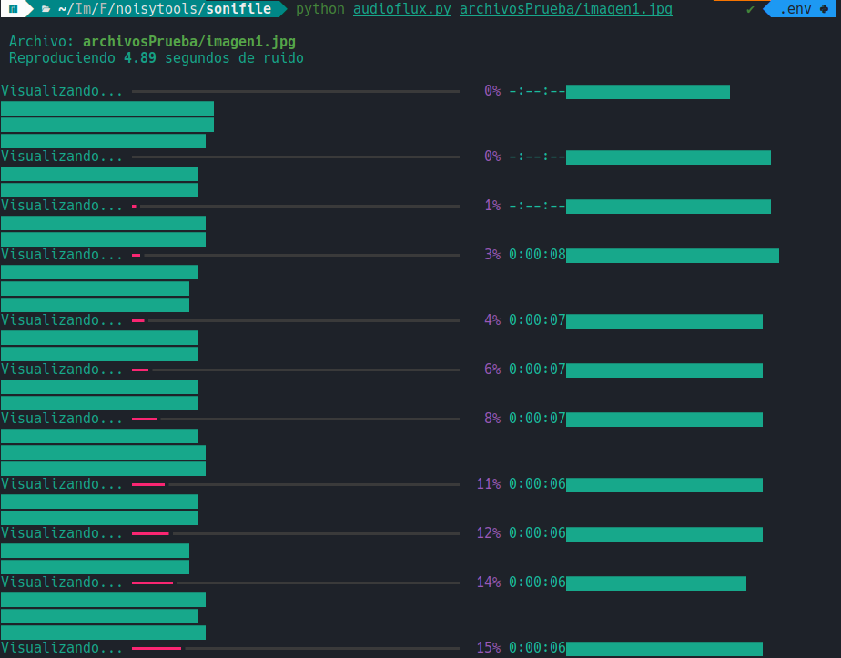
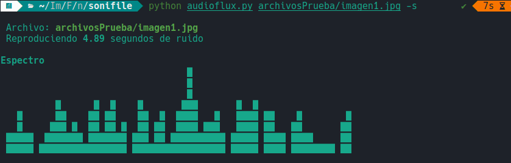

# Sonifile
Convierte cualquier archivo en ruido raw mono ([raw audio](https://en.wikipedia.org/wiki/Raw_audio_format)) codificado como como enteros de 8 bits con signo (`int8`) y una frecuencia de muestreo fija de 44.1 kHz.
Muestra una visualización de volumen o espectro según los argumentos pasados. 
En la carpeta: `archivosPrueba` se han guardado archivos en distintos formatos para probar.
### Uso
1. Modo básico: reproducción y visualización por volumen: 
```python
python audioflux.py archivo
```
La visualización en la terminal será la siguiente:


2. Modo espectro: reproducción y visualización de espectro FFT animado tipo ecualizador ASCII por bloques (añadiendo el argumento: `-s` )
```python
python audioflux.py archivo -s  
```
La visualización en la terminal será la siguiente:

### Requisitos
- Python v3.7 o superior
- pip
(Para ver tu versión de python ejecuta en la terminal lo siguiente `python --version` o `python3 --version`)
### Instalación
```bash
git clone https://github.com/lara-lhh/noisytools.git
cd noisytools/sonifile
pip install requirements.txt
```
Y prueba con cualquier archivo de la carpeta archivosPrueba de la siguiente manera:
```python
python archivosPrueba/imagen1.jpg
python archivosPrueba/imagen1.jpg -s
```
